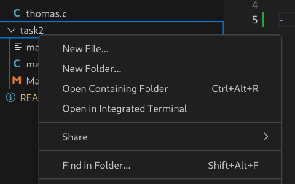

# **Codingspass mit Thomas :))** 

## Ausführen vom Code in Visual Studio Code

- Rechtsklick auf jeweiligen Task-Ordner

Auf `Open in Integrated Terminal` klicken.

- Dabei öffnet sich eine Konsole, die sich direkt im richtigen Verzeichnis befindet.
- `make clean`: löscht alte Binary-File.
- `make`: Kompilieren des Codes mittels `gcc`. Dabei die Erros und Warnings in der Konsole ordentlich gönnen :))
- `./[Programmname]` führt Code aus. Output in Konsole. Programmname: Name der Binary-File (also meistens `main`).
