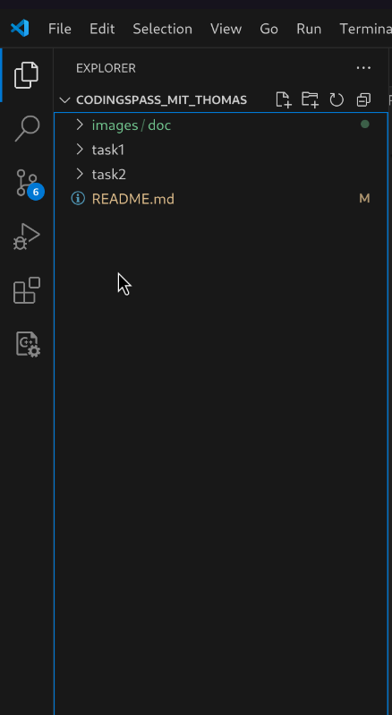

# **Codingspass mit Thomas :))** 

## Clonen des Repositorys
- Am besten mit SSH clonen.
- Für Windows: Git Bash downloaden, um dem How-To 1:1 folgen zu können: https://git-scm.com/downloads   Git Bash emuliert eine Linux-Shell, die es in Windows möglich macht, Linux-Kommandozeilenbefehle auszuführen. 
- How to clone a repo using ssh: https://phoenixnap.com/kb/git-clone-ssh  

## Einbinden vom Projekt in Visual Studio Code
- Files - Open File...   

    

- In das Verzeichnis, in das das Repository gecloned wurde, gehen, Hauptordner markieren & öffnen klicken  

    

- In Visual Studio Code sollte nun im Reiter `Explorer (Strg+Shift+E)` folgende Struktur sichtbar sein:  

    

- In den jeweiligen Task-Ordner befinden sich die Aufgaben mit dem zugehörigen Code.
## Ausführen vom Code in Visual Studio Code

- Rechtsklick auf jeweiligen Task-Ordner & auf `Open in Integrated Terminal` klicken.  

    

 

- Dabei öffnet sich eine Konsole, die sich direkt im richtigen Verzeichnis befindet.
- `make clean`: löscht alte Binary- und Object-Files.
- `make`: Kompilieren des Codes mittels `gcc`. Dabei die Erros und Warnings in der Konsole ordentlich gönnen :))
- `./[Programmname]` führt Code aus. Output in Konsole. Programmname: Name der Binary-File (also meistens `main`).

## Einbinden und Clonen vom Projekt in CLion

- Auf https://github.com/mariofrnz/codingspass_mit_thomas auf `Clone` klicken und dann den `HTTPS` Link kopieren

    

Alternativ kann man das Repository mittels `ssh` lokal auf dem Rechner clonen und das Projekt (wie in Visual Studio Code gezeigt) öffnen.

- Clone Repository: 

    

- Link einfügen und auf `Clone` klicken

    

- Auf `Trust Project` klicken (noscam)

    

- Wenn notwendig: Build Tool, C Compiler und Debugger einstellen

    

